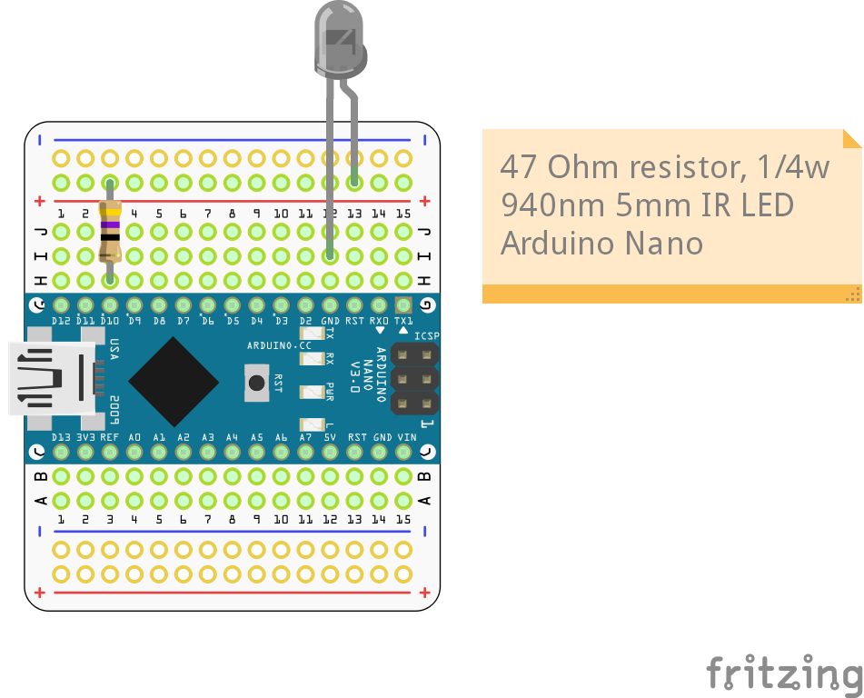
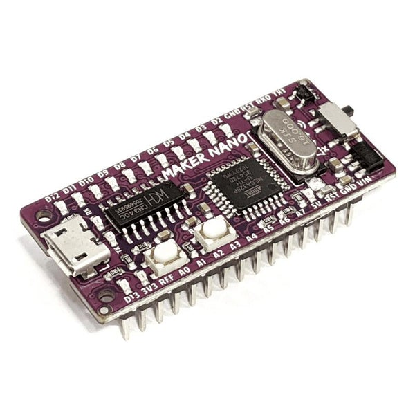
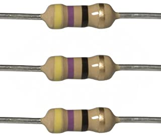
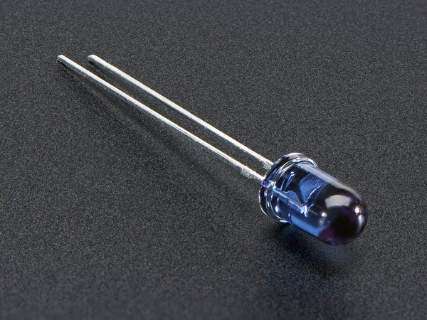

# SimHubIrFlags

Custom serial device for pushing SimHub flag colours to inexpensive IR controlled RGB light strips.  Your mileage may vary on this project depending on which
IR light strips you are using.  Some for example have more latency than others, they do not allow for coloured light flashing, etc.

## Circuit 



## Parts

The parts I used in this project were:

- Cytron Maker Nano - https://thepihut.com/products/maker-nano <br>
  
- 47 Ohm 1/4w Resistor - https://www.amazon.co.uk/Watt-Carbon-Resistor-0-25W-Tolerance/dp/B08Y2S1S6Z <br>
  
- 940nm IR LED 5mm Package - https://thepihut.com/products/super-bright-5mm-ir-led <br>
  
- Clear fronted junction box (83mmx58mmx33mm) - https://www.amazon.co.uk/gp/product/B072FS3W7X
- Optionally a Perma-proto quarter sized board - https://thepihut.com/products/adafruit-perma-proto-quarter-sized-breadboard-pcb-single

## Compiling Instructions

Download a [release](https://github.com/Teqqles/SimHubIrFlags/releases) of the software into an appropriate folder. 

*Note: Arduino IDE likes the parent folder of a project to have the same name as the ino file so remove the version of the parent folder after extracting* 

Follow instructions on installing [Arduino IDE](https://www.arduino.cc/en/software) and download drivers for your Arduino compatible device.  In my case that 
is the Maker Nano and drivers can be found in <http://www.wch.cn/downloads/CH341SER_ZIP.html>, this project should work with other devices but you'll likely have
to change the IR_SEND_PIN (defaults to 10)

Install the [ArduinoJson](https://arduinojson.org/v6/doc/installation/) and [RemoteIR](https://www.ardu-badge.com/IRremote/zip) libraries

To compile this application for the IR light strip type you are using you can modify values in [IrForLedStrip.h](./IrForLedStrip.h)

Select the Arduino Nano as your device (Tools>Board>Arduino AVR Boards) and the appropriate com port for your device.

Hit `Ctrl+R` to make sure the sketch compiles and then `Ctrl+U` if you are happy to upload it to your device, then you can move onto SimHub.

## Configuring in SimHub

This project is built as a custom serial device which by default is hidden in SimHub.  In SimHub go to settings on the left hand nav, then  `Plugins`, from there
find and enable `Custom serial devices`.  This doesn't always immediately show up in the left and nave but if you close and reopen SimHub you should now see
`Custom serial devices` in the left hand nav, click it and expand the Custom Serial Device found there.  Set the port for your arduino project and the baudrate
to `11520`.  Enable RTS, Enable DTR, Log incoming data and Automatic reconnect should all be checked. 

Under the Update messages heading click edit and then click computed value.  Tick the `Use Javascript` box and enter in the command found on [this gist](https://gist.github.com/Teqqles/6145c6e3b0f63947ca54881a094439a2).

If the command is entered in correctly you should see under `Raw result`, something like:

```
{"flag":"X"}
```

Click OK and set the refresh rate.  For some of my light strips I have to set this to `Changes only`, others work best with 5-10hz.   Experiment a little with 
that and once you are happy with the result press the `Freeze/Unfreeze settings` button which will stop any further changes from being made to the messaging.

Ensure your serial device is enabled and now you should have working flags.  Congrats!

## Libraries used

Special thanks to the following, without which this project would have been a lot more complicated:

<https://github.com/bblanchon/ArduinoJson> - Arduino library for Json processing so we can have well formatted input.
<https://github.com/Arduino-IRremote/Arduino-IRremote> - Arduino library for sending and receiving IR instructions.

## Other sources

<http://woodsgood.ca/projects/2015/02/13/rgb-led-strip-controllers-ir-codes/> for the IR controller hex codes.

